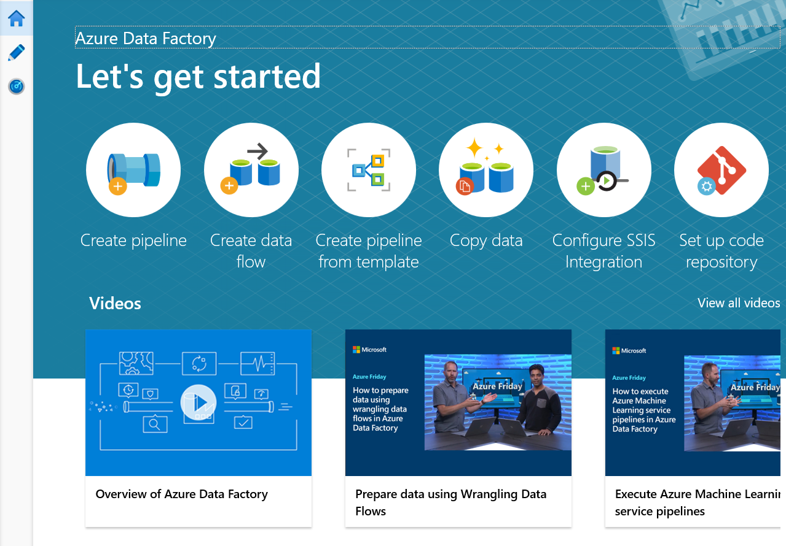
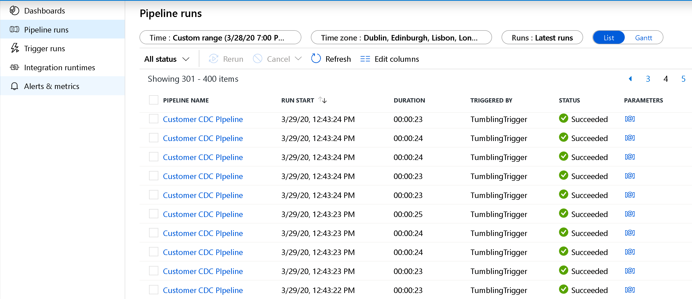

# Incrementally load data from Azure SQL Managed Instance to Azure Storage using change data capture

In this tutorial, you create an Azure data factory with a pipeline that loads delta data based on **change data capture** information in the source Azure SQL Managed Instance database to an Azure blob storage.  

You perform the following steps in this tutorial:

> [!div class="checklist"]
> * Prepare the source data store
> * Create a data factory.
> * Create linked services.
> * Create source, sink, and change data capture datasets.
> * Create, run, and monitor the full copy pipeline
> * Add or update data in the source table
> * Create, run, and monitor the incremental copy pipeline

## Overview
In a data integration solution, incrementally loading data after initial data loads is a widely used scenario. In some cases, the changed data within a period in your source data store can be easily to sliced up (for example, LastModifyTime, CreationTime). In some cases, there is no explicit way to identify the delta data from last time you processed the data. The Change Data Capture technology supported by data stores such as Azure SQL Managed Instances (MI) and SQL Server can be used to identify the delta data.  This tutorial describes how to use Azure Data Factory with SQL Change Data Capture technology to incrementally load delta data from Azure SQL Managed Instance into Azure Blob Storage.  For more concrete information about SQL Change Data Capture technology, see [Change data capture in SQL Server](/sql/relational-databases/track-changes/about-change-data-capture-sql-server?view=sql-server-ver15).

## End-to-end workflow
Here are the typical end-to-end workflow steps to incrementally load data using the Change Data Capture technology.

> [!NOTE]
> Both Azure SQL MI and SQL Server support the Change Data Capture technology. This tutorial uses Azure SQL Managed Instance as the source data store. You can also use an on-premises SQL Server.

1. **Initial loading of historical data** (run once):
    1. Enable Change Data Capture technology in the source Azure SQL MI database.
    2. Get the initial value of SYS_CHANGE_VERSION in the Azure SQL MI database as the baseline to capture changed data.
    3. Load full data from the Azure SQL MI database into an Azure blob storage.
2. **Incremental loading of delta data on a schedule** (run periodically after the initial loading of data):
    1. Get the old and new SYS_CHANGE_VERSION values.
    3. Load the delta data by joining the primary keys of changed rows (between two SYS_CHANGE_VERSION values) from **sys.change_tracking_tables** with data in the **source table**, and then move the delta data to destination.
    4. Update the SYS_CHANGE_VERSION for the delta loading next time.

## High-level solution
In this tutorial, you create two pipelines that perform the following two operations:  

1. **Initial load:** you create a pipeline with a copy activity that copies the entire data from the source data store (Azure SQL Database) to the destination data store (Azure Blob Storage).

    
1.  **Incremental load:** you create a pipeline with the following activities, and run it periodically.
    1. Create **two lookup activities** to get the old and new SYS_CHANGE_VERSION from Azure SQL Database and pass it to copy activity.
    2. Create **one copy activity** to copy the inserted/updated/deleted data between the two SYS_CHANGE_VERSION values from Azure SQL Database to Azure Blob Storage.
    3. Create **one stored procedure activity** to update the value of SYS_CHANGE_VERSION for the next pipeline run.

    


If you don't have an Azure subscription, create a [free](https://azure.microsoft.com/free/) account before you begin.

## Prerequisites
* **Azure SQL Database**. You use the database as the **source** data store. If you don't have an Azure SQL Database, see the [Create an Azure SQL database](../sql-database/sql-database-get-started-portal.md) article for steps to create one.
* **Azure Storage account**. You use the blob storage as the **sink** data store. If you don't have an Azure storage account, see the [Create a storage account](../storage/common/storage-account-create.md) article for steps to create one. Create a container named **raw**. 

### Create a data source table in your Azure SQL database
1. Launch **SQL Server Management Studio**, and connect to your Azure SQL server.
2. In **Server Explorer**, right-click your **database** and choose the **New Query**.
3. Run the following SQL command against your Azure SQL database to create a table named `customers` as data source store.  

    ```sql
    create table customers 
    (
    	customer_id int, 
	first_name varchar(50), 
	last_name varchar(50), 
	email varchar(100), 
	city varchar(50), CONSTRAINT "PK_Customers" PRIMARY KEY CLUSTERED ("customer_id") 
     );
    ```
4. Enable **Change Data Capture** mechanism on your database and the source table (customers) by running the following SQL query:

    > [!NOTE]
    > - Replace &lt;your source schema name&gt; with the schema of your Azure SQL database that has the customers table.
    > - Change data capture doesn't do anything as part of the transactions that change the table being tracked. Instead, the insert, update, and delete operations are written to the transaction log. Data that is deposited in change tables will grow unmanageably if you do not periodically and systematically prune the data. For more information, see [Enable change tracking for a database](/sql/relational-databases/track-changes/enable-and-disable-change-tracking-sql-server#enable-change-tracking-for-a-database)

    ```sql
    EXEC sys.sp_cdc_enable_db 
    
    EXEC sys.sp_cdc_enable_table
    @source_schema = 'dbo',
    @source_name = 'customers', 
    @role_name = 'null',
    @supports_net_changes = 1
    ```
5. Insert data into the customers table by running the following command:

    ```sql
     insert into customers 
     	(customer_id, first_name, last_name, email, city) 
     values 
     	(1, 'Chevy', 'Leward', 'cleward0@mapy.cz', 'Reading'),
     	(2, 'Sayre', 'Ateggart', 'sateggart1@nih.gov', 'Portsmouth')
        (3, 'Nathalia', 'Seckom', 'nseckom2@blogger.com', 'Portsmouth');
	```

    > [!NOTE]
    > No historical changes to the table are captured prior to change data capture being enabled.

## Create a data factory

1. Launch **Microsoft Edge** or **Google Chrome** web browser. Currently, Data Factory UI is supported only in Microsoft Edge and Google Chrome web browsers.
1. On the left menu, select **Create a resource** > **Data + Analytics** > **Data Factory**:

   

2. In the **New data factory** page, enter **ADFTutorialDataFactory** for the **name**.

     

   The name of the Azure data factory must be **globally unique**. If you receive the following error, change the name of the data factory (for example, yournameADFTutorialDataFactory) and try creating again. See [Data Factory - Naming Rules](naming-rules.md) article for naming rules for Data Factory artifacts.

       `Data factory name “ADFTutorialDataFactory” is not available`
3. Select your Azure **subscription** in which you want to create the data factory.
4. For the **Resource Group**, do one of the following steps:

      - Select **Use existing**, and select an existing resource group from the drop-down list.
      - Select **Create new**, and enter the name of a resource group.   
         
        To learn about resource groups, see [Using resource groups to manage your Azure resources](../azure-resource-manager/management/overview.md).  
4. Select **V2 (Preview)** for the **version**.
5. Select the **location** for the data factory. Only locations that are supported are displayed in the drop-down list. The data stores (Azure Storage, Azure SQL Database, etc.) and computes (HDInsight, etc.) used by data factory can be in other regions.
6. Select **Pin to dashboard**.     
7. Click **Create**.      
8. On the dashboard, you see the following tile with status: **Deploying data factory**.

	
9. After the creation is complete, you see the **Data Factory** page as shown in the image.

   
10. Click **Author & Monitor** tile to launch the Azure Data Factory user interface (UI) in a separate tab.
11. In the **get started** page, switch to the **Edit** tab in the left panel as shown in the following image:

    

## Create linked services
You create linked services in a data factory to link your data stores and compute services to the data factory. In this section, you create linked services to your Azure Storage account and Azure SQL database.

### Create Azure Storage linked service.
In this step, you link your Azure Storage Account to the data factory.

1. Click **Connections**, and click **+ New**.

   
2. In the **New Linked Service** window, select **Azure Blob Storage**, and click **Continue**.

   
3. In the **New Linked Service** window, do the following steps:

    1. Enter **AzureStorageLinkedService** for **Name**.
    2. Select your Azure Storage account for **Storage account name**.
    3. Click **Save**.

   


### Create Azure SQL MI Database linked service.
In this step, you link your Azure SQL MI database to the data factory.

    > [!NOTE]
    > For those using SQL MI see [here](https://docs.microsoft.com/en-us/azure/data-factory/connector-azure-sql-database-managed-instance#prerequisites) for information regarding access via public vs private endpoint. If using private endpoint one would need to run this pipeline using a self-hosted integration runtime. The same would apply to those running SQL Server on-prem, in a VM or VNet scenarios.

1. Click **Connections**, and click **+ New**.
2. In the **New Linked Service** window, select **Azure SQL Database**, and click **Continue**.
3. In the **New Linked Service** window, do the following steps:

    1. Enter **AzureSqlMI1** for the **Name** field.
    2. Select your Azure SQL server for the **Server name** field.
    4. Select your Azure SQL database for the **Database name** field.
    5. Enter name of the user for the **User name** field.
    6. Enter password for the user for the **Password** field.
    7. Click **Test connection** to test the connection.
    8. Click **Save** to save the linked service.

       

## Create datasets
In this step, you create datasets to represent data source, data destination. and the place to store the SYS_CHANGE_VERSION.

### Create a dataset to represent source data
In this step, you create a dataset to represent the source data.

1. In the treeview, click **+ (plus)**, and click **Dataset**.

   
2. Select **Azure SQL Database Managed Instance**, and click **Continue**.

   
   
3. In the **Set properties** tab, set the dataset name and connection information:
 
    1. Select **AzureSqlMI1** for **Linked service**.
    2. Select **[dbo].[dbo_customers_CT]** for **Table name**.  Note: this table was automatically created when CDC was enabled on the customers table. Changed data is never queried from this table directly but is instead extracted through the [CDC functions](https://docs.microsoft.com/en-us/sql/relational-databases/system-functions/change-data-capture-functions-transact-sql?view=sql-server-ver15).

   

### Create a dataset to represent data copied to sink data store.
In this step, you create a dataset to represent the data that is copied from the source data store. You created the datalake container in your Azure Blob Storage as part of the prerequisites. Create the container if it does not exist (or) set it to the name of an existing one. In this tutorial, the output file name is dynamically generated by using the trigger time which will be configured later.

1. In the treeview, click **+ (plus)**, and click **Dataset**.

   
2. Select **Azure Blob Storage**, and click **Continue**.

   
3. Select **DelimitedText**, and click **Continue**.

   
4. In the **Set Properties** tab, set the dataset name and connection information:

    1. Select **AzureStorageLinkedService** for **Linked service**.
    2. Enter **raw** for **container** part of the **filePath**.
    3. Enable **First row as header**
    4. Click **Ok**

       

## Create a pipeline to copy the changed data
In this step, you create a pipeline which first checks the number of changed records present in the change table using a **lookup activity**. An IF condition activity checks whether the number of changed records is greater than zero and runs a **copy activity** to copy the inserted/updated/deleted data from Azure SQL Database to Azure Blob Storage. Lastly, a tumbling window trigger is configured and the start and end times will be passed to the activities as the start and end window parameters. 

1. In the Data Factory UI, switch to the **Edit** tab. Click **+ (plus)** in the left pane, and click **Pipeline**.

    
2. You see a new tab for configuring the pipeline. You also see the pipeline in the treeview. In the **Properties** window, change the name of the pipeline to **IncrementalCopyPipeline**.

    
3. Expand **General** in the **Activities** toolbox, and drag-drop the **Lookup** activity to the pipeline designer surface. Set the name of the activity to **GetChangeCount**. This activity gets the number of records in the change table for a given time window.

    
4. Switch to the **Settings** in the **Properties** window:
    i. Specify the SQL MI dataset name for the **Source Dataset** field.
    ii. Select the Query option and enter the following in to the query box:
	```sql
	DECLARE  @from_lsn binary(10), @to_lsn binary(10);  
	SET @from_lsn =sys.fn_cdc_get_min_lsn('dbo_customers');  
	SET @to_lsn = sys.fn_cdc_map_time_to_lsn('largest less than or equal',  GETDATE());
	SELECT count(1) changecount FROM cdc.fn_cdc_get_net_changes_dbo_customers(@from_lsn, @to_lsn, 'all')
	```
    iii. Enable **First row only**

    
5. Click the **Preview data** button to ensure a valid output is obtained by the lookup activity
    
6. Expand **Iteration & conditionals** in the **Activities** toolbox, and drag-drop the **If Condition** activity to the pipeline designer surface. Set the name of the activity to **HasChangedRows**. 
      
7. Switch to the **Activities** in the **Properties** window:
    i . Enter the following **Expression**
```adf
		@greater(int(activity('GetChangeCount').output.firstRow.changecount),0)
```
   
   
    ii. Click on the pencil icon to edit the True condition.
    iii. Expand **General** in the **Activities** toolbox and drag-drop a **Wait** activity to the pipeline designer surface. This is a temporary activity in order to debug the If condition and will be changed later in the tutorial. 


    iv. Click on the IncrementalCopyPipeline breadcrumb to return to the main pipeline.
8. Run the pipeline in **Debug** mode to verify the pipeline executes successfully. 

      
8. Next, return to the True condition step and delete the **Wait** activity. In the **Activities** toolbox, expand **Move & transform**, and drag-drop the **Copy** activity to the pipeline designer surface. Set the name of the activity to **IncrementalCopyActivity**. 


9. Switch to the **Source** tab in the **Properties** window, and do the following steps:

   1. Specify the SQL MI dataset name for the **Source Dataset** field. 
   2. Select **Query** for **Use Query**.
   3. Enter the following SQL query for **Query**.

```sql
     DECLARE @from_lsn binary(10), @to_lsn binary(10); 
     SET @from_lsn =sys.fn_cdc_get_min_lsn('dbo_customers'); 
     SET @to_lsn = sys.fn_cdc_map_time_to_lsn('largest less than or equal', GETDATE());
     SELECT * FROM cdc.fn_cdc_get_net_changes_dbo_customers(@from_lsn, @to_lsn, 'all')
```

10. Click preview to verify that the query returns the changed rows correctly.


11. Switch to the **Sink** tab, and specify the Azure Storage dataset for the **Sink Dataset** field.


12. **Connect both Lookup activities to the Copy activity** one by one. Drag the **green** button attached to the **Lookup** activity to the **Copy** activity.


11. Drag-and-drop the **Stored Procedure** activity from the **Activities** toolbox to the pipeline designer surface. Set the name of the activity to **StoredProceduretoUpdateChangeTrackingActivity**. This activity updates the change tracking version in the **table_store_ChangeTracking_version** table.


12. Switch to the *SQL Account** tab, and select **AzureSqlDatabaseLinkedService** for **Linked service**.


13. Switch to the **Stored Procedure** tab, and do the following steps:

    1. For **Stored procedure name**, select **Update_ChangeTracking_Version**.  
    2. Select **Import parameter**.
    3. In the **Stored procedure parameters** section, specify following values for the parameters:

        | Name | Type | Value |
        | ---- | ---- | ----- |
        | CurrentTrackingVersion | Int64 | @{activity('LookupCurrentChangeTrackingVersionActivity').output.firstRow.CurrentChangeTrackingVersion} |
        | TableName | String | @{activity('LookupLastChangeTrackingVersionActivity').output.firstRow.TableName} |

        
14. **Connect the Copy activity to the Stored Procedure Activity**. Drag-and-drop the **green** button attached to the Copy activity to the Stored Procedure activity.

    
15. Click **Validate** on the toolbar. Confirm that there are no validation errors. Close the **Pipeline Validation Report** window by clicking **>>**.

    
16. Publish entities (linked services, datasets, and pipelines) to the Data Factory service by clicking the **Publish All** button. Wait until you see the **Publishing succeeded** message.

           

### Run the incremental copy pipeline
1. Click **Trigger** on the toolbar for the pipeline, and click **Trigger Now**.

    
2. In the **Pipeline Run** window, select **Finish**.

### Monitor the incremental copy pipeline
1. Click the **Monitor** tab on the left. You see the pipeline run in the list and its status. To refresh the list, click **Refresh**. The links in the **Actions** column let you view activity runs associated with the pipeline run and to rerun the pipeline.

    
2. To view activity runs associated with the pipeline run, click the **View Activity Runs** link in the **Actions** column. There is only one activity in the pipeline, so you see only one entry in the list. To switch back to the pipeline runs view, click **Pipelines** link at the top.

    


### Review the results
You see the second file in the `incchgtracking` folder of the `adftutorial` container.


The file should have only the delta data from the Azure SQL database. The record with `U` is the updated row in the database and `I` is the one added row.

```
1,update,10,2,U
6,new,50,1,I
```
The first three columns are changed data from data_source_table. The last two columns are the metadata from change tracking system table. The fourth column is the SYS_CHANGE_VERSION for each changed row. The fifth column is the operation:  U = update, I = insert.  For details about the change tracking information, see [CHANGETABLE](/sql/relational-databases/system-functions/changetable-transact-sql).

```
==================================================================
PersonID Name    Age    SYS_CHANGE_VERSION    SYS_CHANGE_OPERATION
==================================================================
1        update  10		2			          U
6        new     50		1			          I
```


## Next steps
Advance to the following tutorial to learn about copying new and changed files only based on their LastModifiedDate:

> [!div class="nextstepaction"]
>[Copy new files by lastmodifieddate](tutorial-incremental-copy-lastmodified-copy-data-tool.md)
